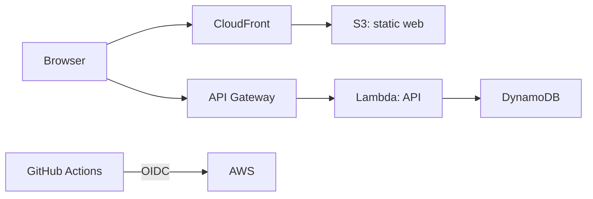

# personal-webapp-terraform

個人開発の Web アプリを、必要になった箇所だけ伸ばせるモジュラーモノリスとして始めるためのテンプレートです。

最初は、静的フロントエンド、単一の API、DynamoDB を分けます。認証、非同期処理、検索、複数サービスは、負荷や運用上の理由が生じてから追加します。



## 構成

- `apps/web`: 配信する静的フロントエンドの最小例です。
- `apps/api`: Lambda で動かす HTTP API の最小例です。
- `infra/bootstrap-github`: GitHub リポジトリを Terraform で作る Bootstrap 用コードです。
- `infra/aws`: AWS 上の実行基盤を作る Terraform コードです。
- `.github/workflows`: テストと Terraform の書式検査です。

## まず GitHub リポジトリを作る

Bootstrap は、このリポジトリを初回作成するときだけローカルで実行します。トークンをファイルへ保存しません。

```powershell
$env:GITHUB_TOKEN = gh auth token
Set-Location infra/bootstrap-github
terraform init
terraform apply -var 'repository_name=personal-webapp-terraform'
```

作成後にリポジトリの URL を確認し、プロジェクト直下で初回 push します。

```powershell
git init --initial-branch=main
git add -- .
git commit -m '個人開発向けWebアプリの初期構成を追加'
git remote add origin https://github.com/<GitHubユーザー名>/personal-webapp-terraform.git
git push -u origin main
```

## ローカル確認

```powershell
Set-Location apps/api
npm test

Set-Location ../../infra/bootstrap-github
terraform fmt -check -recursive
terraform validate
```

`infra/aws` を apply する前に、S3 のバックエンドと AWS の予算アラートを準備してください。個人開発では state を Git に置かず、開発・本番を同じ state に混在させないことが重要です。

## 次に追加する判断

| 症状 | 追加するもの |
|---|---|
| ログインが必要 | Cognito などの外部 IdP |
| 画面操作が遅い | API の計測、DynamoDB のアクセスパターン見直し |
| 数秒以上かかる処理 | SQS と Lambda の非同期ワーカー |
| データ検索が複雑 | 専用検索基盤を検討 |
| 1 人で管理し切れない | 監視・Runbook・権限分離を先に整備 |
