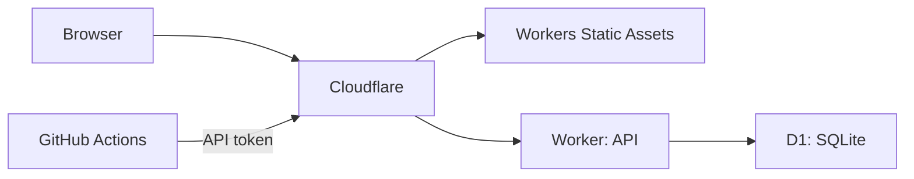

# personal-webapp-terraform

個人開発の Web アプリを、必要になった箇所だけ伸ばせるモジュラーモノリスとして始めるためのテンプレートです。

最初は Cloudflare を入口と実行基盤にします。静的フロントエンドは Workers の Static Assets、API は単一 Worker、SQL データは D1 を使います。認証、非同期処理、検索、複数サービスは、負荷や運用上の理由が生じてから追加します。



## 構成

- `apps/web`: Worker から配信する静的フロントエンドの最小例です。
- `apps/worker`: API と静的アセットの入口になる Cloudflare Worker です。
- `infra/bootstrap-github`: GitHub リポジトリを Terraform で作る Bootstrap 用コードです。
- `infra/cloudflare`: D1 など Cloudflare アカウント資源を作る Terraform コードです。
- `infra/aws`: AWS を採用する必要が出た場合の代替案です。初期構成では apply しません。
- `.github/workflows`: テストと Terraform の書式検査です。

## まず GitHub リポジトリを作る

Bootstrap は、このリポジトリを初回作成するときだけローカルで実行します。トークンをファイルへ保存しません。

```powershell
$env:GITHUB_TOKEN = gh auth token
Set-Location infra/bootstrap-github
terraform init
terraform apply -var 'repository_name=personal-webapp-terraform'
```

作成後にリポジトリの URL を確認し、プロジェクト直下で初回 push します。

```powershell
git init --initial-branch=main
git add -- .
git commit -m '個人開発向けWebアプリの初期構成を追加'
git remote add origin https://github.com/<GitHubユーザー名>/personal-webapp-terraform.git
git push -u origin main
```

## ローカル確認

```powershell
Set-Location apps/worker
npm test

Set-Location ../../infra/cloudflare
terraform fmt -check -recursive
terraform validate
```

## Cloudflare を低コストで始める

Workers Free の範囲で動く小規模アプリを想定しています。無料枠の上限を超えると、Worker の処理が失敗する場合があるため、アクセス数と D1 の読み書き行数を確認してください。価格や上限は変更されるため、開始前に [Workers の料金](https://developers.cloudflare.com/workers/platform/pricing/) を確認します。

Cloudflare の API トークンとアカウント ID は Git に保存しません。Terraform には環境変数で渡します。

```powershell
$env:CLOUDFLARE_API_TOKEN = '<Cloudflare API Token>'
Set-Location infra/cloudflare
terraform init
terraform plan -var 'cloudflare_account_id=<Account ID>' -var 'project_name=personal-webapp'
terraform apply -var 'cloudflare_account_id=<Account ID>' -var 'project_name=personal-webapp'
```

apply 後に出力された D1 の ID を `apps/worker/wrangler.d1.example.jsonc` へ設定して `wrangler.jsonc` に反映します。その後、次を実行します。

```powershell
Set-Location apps/worker
npx wrangler deploy
```

個人開発では state を Git に置かず、開発・本番を同じ state に混在させないことが重要です。共有や CI で apply する段階になったら、リモート state と環境別の Cloudflare API トークンを追加してください。

## 次に追加する判断

| 症状 | 追加するもの |
|---|---|
| ログインが必要 | Cloudflare Access または外部 IdP |
| 画面操作が遅い | Worker の計測、D1 のクエリ見直し |
| 数秒以上かかる処理 | Cloudflare Queues などの非同期ワーカー |
| データ検索が複雑 | 専用検索基盤を検討 |
| 1 人で管理し切れない | 監視・Runbook・権限分離を先に整備 |
